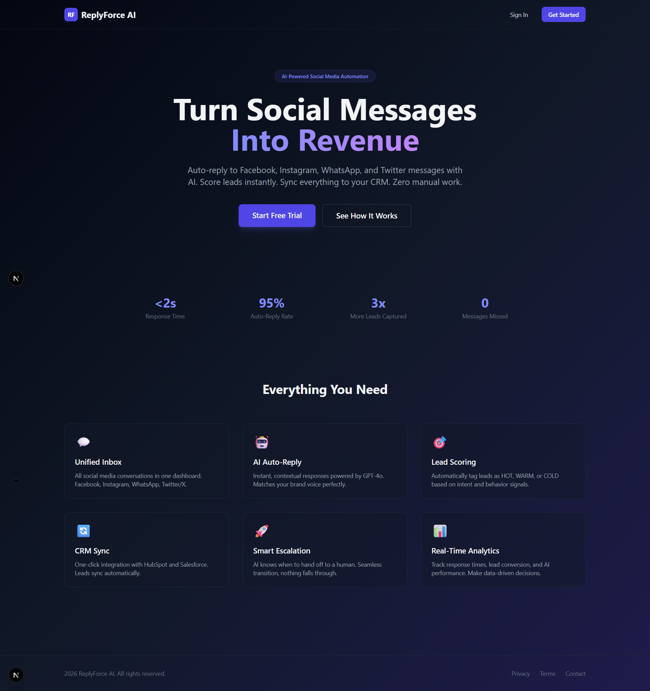

# ReplyForce AI

**AI-powered social media auto-reply and lead scoring SaaS platform.**

Connect Facebook, Instagram, WhatsApp, and Twitter/X. Get AI-generated replies in <2 seconds. Score leads automatically. Sync everything to your CRM.

---

## Preview



---

## Quick Start

### Prerequisites

- Node.js 20+
- Docker & Docker Compose
- OpenAI API Key

### 1. Clone and Setup

```bash
cp .env.example .env
# Edit .env with your API keys
```

### 2. Start Infrastructure

```bash
npm run docker:up
# Starts PostgreSQL, Redis
```

### 3. Install Dependencies

```bash
npm install
```

### 4. Run Database Migrations

```bash
npm run db:migrate
```

### 5. Start Development

```bash
npm run dev
# Starts: Backend (3001), Frontend (3000), Workers
```

### Access Points

| Service | URL |
|---|---|
| Frontend Dashboard | http://localhost:3000 |
| Backend API | http://localhost:3001 |
| API Documentation | http://localhost:3001/docs |
| Redis Commander | http://localhost:8081 (debug profile) |

---

## Architecture

See [ARCHITECTURE.md](./ARCHITECTURE.md) for the complete system design document covering:

- System architecture diagrams
- AI agent pipeline design (6 specialized agents)
- Data flow documentation
- Authentication & authorization
- Data security & GDPR compliance
- Cost optimization strategies
- Failure scenarios & recovery
- Tech stack justifications
- Database schema
- API contracts
- SaaS pricing model

---

## Project Structure

```
replyforce-ai/
├── ARCHITECTURE.md              # Complete system architecture document
├── .env.example                 # Environment variable template
├── package.json                 # Monorepo root
├── tsconfig.base.json           # Shared TypeScript config
│
├── packages/
│   ├── backend/                 # NestJS API Server
│   │   ├── prisma/schema.prisma # Database schema (PostgreSQL)
│   │   └── src/
│   │       ├── main.ts          # Application entry
│   │       ├── app.module.ts    # Module registry
│   │       ├── database/        # Prisma + Redis services
│   │       ├── common/          # Guards, decorators, filters, interceptors
│   │       └── modules/
│   │           ├── auth/        # JWT auth, OAuth, RBAC
│   │           ├── channels/    # Social channel management + token vault
│   │           ├── conversations/ # Unified inbox
│   │           ├── leads/       # Lead management + scoring
│   │           ├── webhooks/    # Platform webhook receivers
│   │           ├── crm/         # CRM sync (HubSpot, Salesforce)
│   │           ├── analytics/   # Dashboard metrics
│   │           ├── settings/    # Brand voice, team management
│   │           └── websocket/   # Real-time updates
│   │
│   ├── ai-agents/               # AI Agent Pipeline
│   │   └── src/
│   │       ├── orchestrator/    # Pipeline coordinator
│   │       ├── agents/
│   │       │   ├── guardrail.agent.ts         # Input/output safety
│   │       │   ├── message-understanding.agent.ts  # Message parsing
│   │       │   ├── sentiment.agent.ts          # Emotion detection
│   │       │   ├── lead-scoring.agent.ts       # HOT/WARM/COLD scoring
│   │       │   ├── auto-reply.agent.ts         # Reply generation
│   │       │   └── crm-sync.agent.ts           # CRM field mapping
│   │       ├── prompts/         # LLM system prompts
│   │       └── models/          # Type definitions
│   │
│   ├── workers/                 # Queue Processors
│   │   └── src/processors/
│   │       ├── inbound-message.processor.ts   # Core: message → AI → reply
│   │       ├── outbound-message.processor.ts  # Send replies to platforms
│   │       └── crm-sync.processor.ts          # Sync leads to CRM
│   │
│   └── frontend/                # Next.js Dashboard
│       └── src/
│           ├── app/
│           │   ├── page.tsx              # Landing page
│           │   ├── auth/page.tsx         # Login/register
│           │   └── dashboard/
│           │       ├── page.tsx           # Overview
│           │       ├── inbox/page.tsx     # Unified inbox
│           │       ├── leads/page.tsx     # Lead management
│           │       ├── analytics/page.tsx # AI performance
│           │       └── settings/page.tsx  # Configuration
│           ├── lib/api.ts        # API client
│           ├── hooks/            # Real-time WebSocket hooks
│           └── stores/           # Zustand state management
│
└── infrastructure/
    └── docker/
        ├── docker-compose.yml   # Development environment
        ├── Dockerfile.backend   # Production backend image
        ├── Dockerfile.frontend  # Production frontend image
        ├── Dockerfile.workers   # Production workers image
        └── init-db.sql          # RLS policies
```

---

## Tech Stack

| Layer | Technology | Why |
|---|---|---|
| Frontend | Next.js 15, TanStack Query, Zustand, Tailwind CSS | SSR, React ecosystem, minimal bundle |
| Backend | NestJS, Prisma, BullMQ | TypeScript E2E, DI, modular |
| AI | OpenAI GPT-4o + GPT-4o-mini + Rules Engine | Quality where it matters, cost-efficiency everywhere else |
| Database | PostgreSQL 16 with RLS | Multi-tenant isolation, JSONB |
| Cache/Queue | Redis 7 + BullMQ | Single dependency for cache + queue + pub/sub |
| Auth | JWT + Passport.js + bcrypt | Full control, no per-MAU costs |
| Real-time | Socket.io + Redis pub/sub | Cross-instance WebSocket |

---

## AI Agent Pipeline

Each message flows through 6 specialized agents:

```
Message → Guardrail → Understanding → Sentiment → Lead Scoring → Auto-Reply → Output Guardrail → Send
```

| Agent | Model | Cost/msg | Latency |
|---|---|---|---|
| Guardrail | Rules engine | $0 | <5ms |
| Understanding | GPT-4o-mini | $0.00015 | ~300ms |
| Sentiment | Rules + local model | $0 | <10ms |
| Lead Scoring | Weighted rules | $0 | <5ms |
| Auto-Reply | GPT-4o | $0.003 | ~800ms |
| Output Guardrail | Rules engine | $0 | <5ms |
| **Total** | | **$0.00315** | **~2.3s** |

---

## License

Proprietary. All rights reserved.
